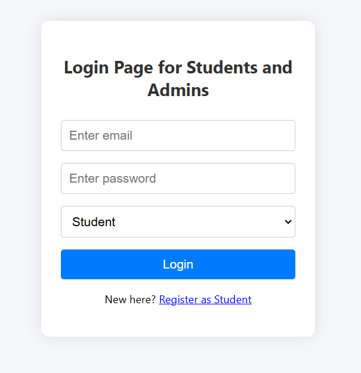
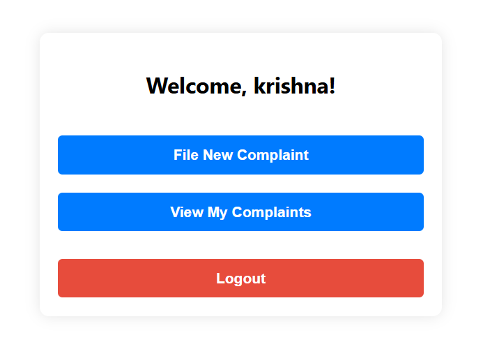
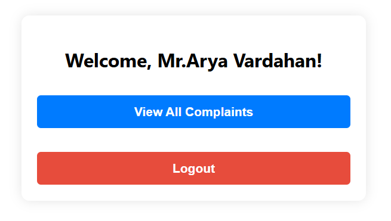
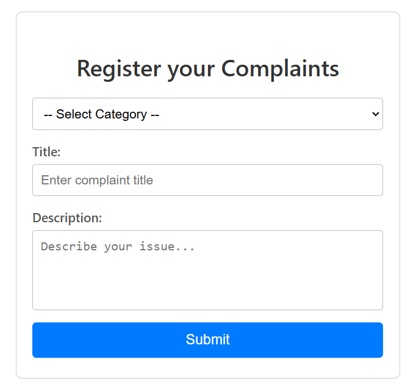
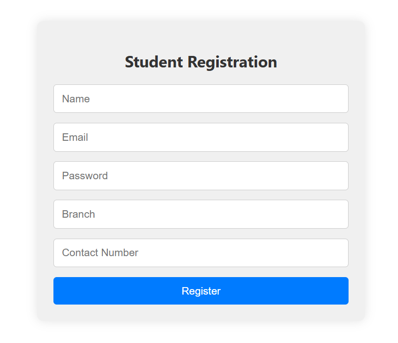
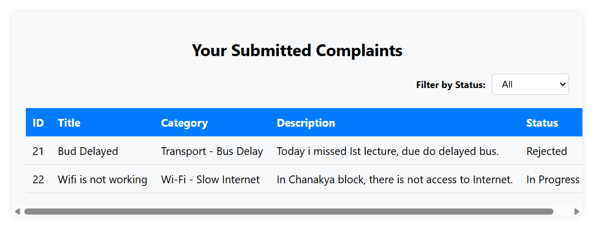
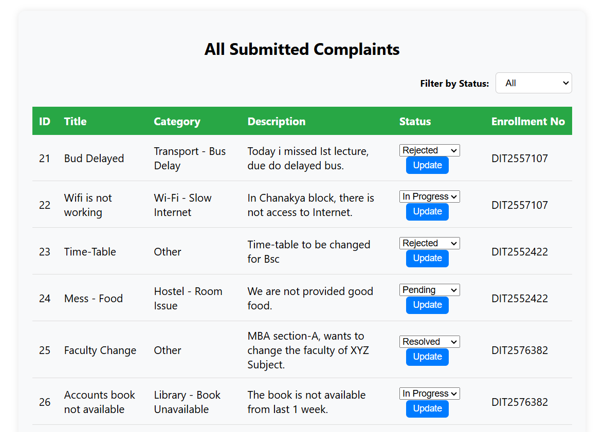
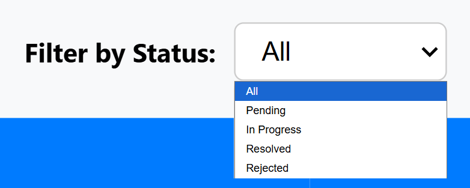

README - College Complaint Management System

# College Complaint Management System

> A simple app for students to submit complaints and for admins to manage them.
> React frontend with Spring Boot & MySQL backend (in progress)

## Features

- **Student Login:** Students can log in with their credentials.
- **Admin Login:** Admins can log in separately.
- **Role-Based Access:** Students and admins see only what they are allowed to.
- **Submit Complaint:** Students can submit new complaints.
- **View Complaints:** Students can view their own complaints.
- **View All Complaints:** Admins can see all complaints submitted by students.
- **Update Status:** Admins can update complaint status (Pending, In Progress, Resolved).
- **Filter Complaints:** Admins can filter complaints based on status.

## Tech Used

- **Frontend:** React.js
- **Backend:** Spring Boot, MySQL

## Screenshots
*(Add images here)*

1. Login Page
   
   
   
2. Student Dashboard
   
   
   
3. Admin Dashboard
   
   
   
4. Complaint Form
   
   

5. Student Registration Page
   
   
   
6. Student Complaint History
   
   
   
7. List of Complaints (Admin)
   
   
   
8. Complaint Filters
   
      
   

## Demo Video
*(Add link here)*

## How to Run

### 1. Clone Repo
```bash
git clone <your-repo-url>
cd college-complaint-system
```

### 2. Backend
- Open the backend folder in your IDE (like IntelliJ).
- Update `application.properties` with your MySQL info:
- 
```properties
spring.datasource.url=jdbc:mysql://localhost:3306/your_database_name
spring.datasource.username=your_username
spring.datasource.password=your_password
spring.jpa.hibernate.ddl-auto=update
```
- Run the Spring Boot application.

### 3. Frontend
- Open the frontend folder and install dependencies:

```bash
npm install
npm start
```
- Open http://localhost:3000 in your browser.

## Future Enhancements

- **Full Security with JWT:** Implement JWT-based authentication for secure login and API access.
- **Two-Factor Authentication (2FA):** Add an extra layer of security for both students and admins.
- **Search Complaints:** Allow admins to search complaints by title, student name, or status.
- **Advanced Filtering:** Filter complaints by status, date, or category.

